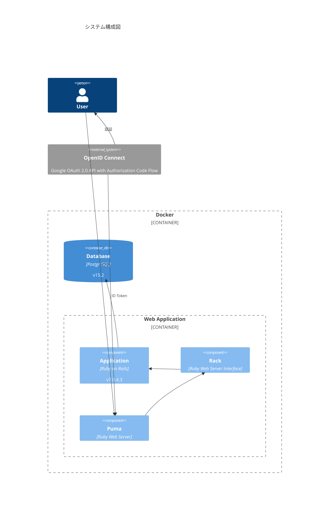

# 雇用保険給付の相棒（Employmate）

<p>
  <a href="https://github.com/maeda-m/employmate/blob/main/LICENSE" target="_blank">
    
  </a>
</p>

病気やケガで退職した後、働く意思がある60歳未満の方向けの、雇用保険の失業等給付（基本手当）がいつ頃になるかがわかるWebサービスです。


## エレベーターピッチ

病気やケガで退職した後、働く意思がある 60 歳未満の方は、スムーズかつ待ち時間なく雇用保険給付を受けるために手続きをしたいと考えています。
しかし、制度や必要な書類の要件が複雑で、給付が確定するまでの待ち時間が長くなりがちであるため、ハローワークや厚生労働省の資料を熟読したり、ハローワークの窓口で雇用保険給付調査官に都度質問することによって解決しなければなりません。
しかしながら、雇用保険受給資格者証を受け取るまでの進行度がわかりにくく、初回の給付金を受け取る予定がいつ頃なのかが不明瞭な点が課題とされています。
そこで、本サービスを利用することで、雇用保険受給資格者証を受け取るまでの進行度や初回の給付金を受け取れる予定などがわかるようになります。

具体的には次の流れで課題を解決します。

1. 残業時間や診断書の有無などを入力することで、ユーザーの事情を考慮した雇用保険制度（ハローワーク訪問時期・頻度と用意する書類）と大まかな初回の給付金振込予定日がわかります。
2. ユーザーの事情に合わせたチェックリストを提供し、ハローワーク訪問時期や頻度、用意する書類などが明確になります。
3. チェックリストを完了していくと、雇用保険受給資格者証を受け取るまでの進行度や、より正確な初回の給付金振込予定日がわかるようになります。

## セットアップと起動方法

コンテナを起動し、セットアップコマンドを実行してください。

> **Note**
>
> Google でログインを有効にするため、 [Google Cloud Console](https://console.cloud.google.com/) で「OAuth 同意画面」と「OAuth 2.0 クライアント ID」を設定してください。
> その後 `.env` ファイルを作成し `GOOGLE_OPENID_CONNECT_CLIENT_ID` として値を設定してください。

```shell
docker compose up -d
docker compose exec rails bash
chmod +x bin/*
bin/setup
```

> **Note**
>
> bin/setup は次のコマンドを実行しています。
>
> - bin/rails db:create
> - bin/rails db:migrate
> - bin/rails db:seed #=> 初期データを再実行しても重複しないように投入します
> - bin/rails yarn:install #=> Linter などの開発に使用する npm パッケージをインストールします
> - bin/rails log:clear
> - bin/rails tmp:clear
> - bin/rails restart #=> tmp/restart.txt を作成し、開発サーバーが再起動するようにします

開発サーバーは次のコマンドで実行します。

```shell
bin/dev
```

大まかな構成は下図のとおりです。



## Linter

次のコマンドで lint を実行します。

```shell
bundle exec erblint app/
bundle exec rubocop
bundle exec brakeman
npm run eslint
npm run stylelint
npm run prettier
npm run secretlint
```

## Test

次のコマンドで test を実行します。

> **Note**
>
> ヘッドレスブラウザでどのようにテストが実行されているかを確認したいときは `VIDEO=yes` を指定してください。 WebM 形式で動画が保存されます。

```shell
RAILS_ENV=test bin/rails db:seed
bundle exec rspec
```

## License

[MIT](https://github.com/maeda-m/employmate/blob/main/LICENSE) licensed.
