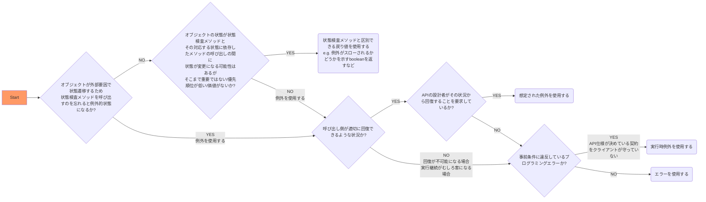

# 開発方針

この文書は上記の効能のために開発の流れとセルフレビューの観点を説明したものです。なお適用範囲はこのプロダクトに限ります。

コードをセルフレビューすることで、ソフトウェアを変更しやすくする働きかけを期待します。
ソフトウェアはソフトであるため、なるべく簡単に変更でき、かつ捨てやすくなければならないと考えます。

## 開発の流れ

1. 着手する議題をあらわすブランチを作成する
2. 受け入れ条件（`Background -> Given, Feature -> Scenario -> When, Then`）または単体テスト（`describe -> context -> it`）の中身は置いておいて、枠だけを記述する
   - [タスクばらし](https://qiita.com/jnchito/items/017487cd882091494298) の前段である現行仕様からの変更点や機能追加の要件を説明するように確認したい項目を挙げる
   - この時点では実装をしていないため、テストの意図がわかりやすく、期待値がベタ書きにでき、実装の詳細が表に出てこないはずです
3. [Draft](https://docs.github.com/ja/pull-requests/collaborating-with-pull-requests/proposing-changes-to-your-work-with-pull-requests/changing-the-stage-of-a-pull-request) のプルリクエストを作成する
   - プルリクエストのテンプレートにある実装方針を箇条書きでよいので書いておく
4. 細かい仕様は置いておいて、ひとまず動作するものを作る
   - 不具合修正の場合は先にテストコードを書いて Red にして再現させる
5. 保留となっているテストコードをすべて書いて動作を保証する
   - Yellow から Red なテストと Green なテストを明確にします
6. 細かい仕様を作りこむ・機能を追加するうえでリファクタリングして変更しやすくする
   - Red なテストを Green にし、かつ Refactoring します
7. プルリクエストのコメント機能を使ってコードの表現だけでは意図が伝わらなさそうな箇所を補足します
   - 補足が必要な理由を自問して改善できるかを検討します
   - 例えば変数に対して補足しているのであれば名づけを見直しします
   - 仕様がそもそも難しいものについては使い方・扱い方がちょうどよいかを見直しします

**参考情報**

- [雑に作って、それから作り込んで、最後にテストを書く「テストラスト」開発 - give IT a try](https://blog.jnito.com/entry/2023/02/16/171810)
- [すばやく確認 OK をもらうためのセルフレビュー - よもやま話 β 版](https://beta-chelsea.hatenadiary.jp/entry/2020/12/19/125756)
- [テストコードにはテストの意図を込めよう #vstat - Speaker Deck](https://speakerdeck.com/nihonbuson/tesutokodonihatesutofalseyi-tu-woip-meyou)
- [リーダブルテストコード / #vstat - Speaker Deck](https://speakerdeck.com/jnchito/number-vstat)
- [テストコードの期待値は DRY を捨ててベタ書きする ～テストコードの重要な役割とは？～ - Qiita](https://qiita.com/jnchito/items/eb3cfa9f7db752dcb796)
- [【アンチパターン】Arrange、Act、Assert（AAA）を意識できていない RSpec のコード例とその対処法 - Qiita](https://qiita.com/jnchito/items/91779b55cae0f4915da5)

## セルフレビューの観点

次の観点が必要と考えます。より具体的な観点は後述とします。

> 出典：[コードレビューの観点 | google-eng-practices-ja maintained by FujiHaruka](https://fujiharuka.github.io/google-eng-practices-ja/ja/review/reviewer/looking-for.html) より抜粋
>
> コードレビューをする際には、次のことを確認してください。
>
> - コードがうまく設計されている
> - 機能性がコードのユーザーにとって適切である
> - UI の変更がある場合、よく考えられていて見た目も適切である
> - 並行処理がある場合、安全に行われている
> - コードが必要以上に複雑でない
> - 開発者は将来必要になる**かもしれない**ものではなく、現在必要だとわかっているものを実装している
> - コードには適切なユニットテストがある
> - テストがうまく設計されている
> - 開発者はあらゆるものに明確な名前を使った
> - コメントは明確で有意義なもので、**「何」**ではなく**「なぜ」**を説明している
> - コードは適切にドキュメント化されている（一般的には g3doc で）
> - コードはスタイルガイドに準拠している
>
> レビューを依頼されたコードを**一行ずつ**レビューすること、**コンテキスト**を確認すること、**コードの健康状態を改善**しているかを見極めること、開発者が**良いこと**をしたらそれを褒めることを忘れずに。

### コードがうまく設計されている・テストがうまく設計されている・開発者はあらゆるものに明確な名前を使った

設計と実装は不可分であることを前提として、役割や特徴が巨大ではなく、いい感じの期待感と目的に合った責務へ分解されていることがうまい設計と考えます。

言い換えると使う側からのテストがしやすい設計として次の特徴があると言えるでしょう。

- 公開されているクラス名やメソッド名から使い方が想像でき、内部の詳細を考えなくてもいいこと
- 環境変数や引数に依存するのであれば、外部から依存を注入できること

言い換えると疑問や誤解が生じない、行間を読ませない次の要素を備えたコードであると言えるでしょう。

1. 詳細を読まなくても予測可能なメソッド名や引数、戻り値であること
   - テストコードを読んでメソッド名と振る舞いが腹落ちすること
   - インターフェースとしていろいろな使い方があると混乱する
   - 副作用をおこしていないか
   - 余計なことをしていないか
   - 驚きを与えていないか
   - メソッドの帰属先として、そのクラスに対する操作で違和感がないか
   - `?` がついているのに Boolean 以外を返していないか
2. 必要最小限の可視性を持つメソッドであること
   - クラスメソッドであれば必要かを考え、プライベートなインスタンスメソッドでよいかを考える
   - 外的要因で上書きされる可能性を排除することで安心できる
   - 使う側の気持ちとして知らなくていいものがあればそれを排除する
3. 必要以上に引数でデフォルト式や遅延初期化をしていないこと
   - デフォルト式で使い分けを期待しているのであればいいが、そうでないなら混乱する
   - 保守する際に必要な記述の判断に迷うので、万が一なら書かない
   - 必要であれば契約が守られていない場合はエラーを投げるなど親切にする
4. メソッドチェーンが深すぎずコードリーディングを阻害していないこと
   - ワンライナーな記述をメソッドにしていないか
   - 再帰的な処理が直感的か
   - [ThoughtWorks アンソロジー オブジェクト指向エクササイズ](https://www.oreilly.co.jp/books/9784873113890/) を適用するとどうなるか
5. 凝ったことをしていないこと
   - 愚直に書いたほうが誤解のしようがないためわかりやすい
   - 使わないブロックは削除しよう
   - 使わないブロックパラメータは削除しよう
6. 本体のコードベースをより少ないコードにしていること
   - 必要そうな機能を Gem で実現できるかを検討していること
   - Gem がなかったら lib 配下に実装していること（将来的に Gem に分離する）

**参考情報**

- [rubytips - komagata のブログ](https://docs.komagata.org/tags/rubytips/)
- [レガシープログラマかどうかを判断する 10 項目 - give IT a try](https://blog.jnito.com/entry/20110218/1297983647)
- [関心の分離を意識した名前設計で巨大クラスを爆殺する - Qiita](https://qiita.com/MinoDriven/items/37599172b2cd27c38a33)
- [役割駆動設計で巨大クラスを爆殺する - Qiita](https://qiita.com/MinoDriven/items/2a378a09638e234d8614)
- [モデルやメソッドに名前を付けるときは英語の品詞に気をつけよう - Qiita](https://qiita.com/jnchito/items/459d58ba652bf4763820)
- [[初心者向け] Ruby や Rails でリファクタリングに使えそうなイディオムとか便利メソッドとか - Qiita](https://qiita.com/jnchito/items/dedb3b889ab226933ccf)
- [入門 名前 - Speaker Deck](https://speakerdeck.com/fujimura/ru-men-ming-qian)
- [設計の考え方とやり方 - Speaker Deck](https://speakerdeck.com/masuda220/she-ji-falsekao-efang-toyarifang?slide=50)
- [良い設計と悪い設計の違い - Speaker Deck](https://speakerdeck.com/masuda220/good-or-bad-that-is-a-question?slide=14)
  - [区分の例](https://github.com/maeda-m/ruby-practices/tree/19f1ccfa731545eaa580782f26c170cdc913b7a7/07.bowling_object/bowling/frame/type)
  - [コレクションの例](https://github.com/maeda-m/ruby-practices/blob/19f1ccfa731545eaa580782f26c170cdc913b7a7/07.bowling_object/bowling/frame/transfer_collection.rb)
  - [値の例](https://github.com/maeda-m/ruby-practices/blob/19f1ccfa731545eaa580782f26c170cdc913b7a7/07.bowling_object/bowling/frame/record_value.rb)
- [Getting Real 的なものとそうでないもの - komagata のブログ](https://docs.komagata.org/5741)

### コードはスタイルガイドに準拠している

RuboCop などの静的解析ツールを活用することで、スタイルガイドに準拠したプログラムの書き方や、ある程度の読みやすさ、未使用の変数がないことを確認できます。
基本的には静的解析ツールで検出された内容と [レイヤーリング](https://www.oreilly.com/library/view/patterns-of-enterprise/0321127420/ch01.xhtml) に準拠しているかどうかを確認すればよいと考えます。

#### レイヤーリング

レイヤーリングとは、Patterns of Enterprise Application Architecture（以下、PoEAA という）において、プレゼンテーション、ドメイン、データソースという 3 つの主要な層からなるアーキテクチャを指しています。
[MVC](https://bliki-ja.github.io/pofeaa/ModelViewController/) アーキテクチャスタイルなど、上位層は下位層が定義するさまざまなサービスを利用するが、下位層は上位層のことを知りません（ドメインとデータソースは、決してプレゼンテーションに依存しない）。

> ▼ 表. 3 つの主要レイヤー

| レイヤー           | 責任                                                                                                                          |
| ------------------ | ----------------------------------------------------------------------------------------------------------------------------- |
| プレゼンテーション | サービスの提供、情報の表示（例：HTML、ユーザーのマウスクリックやキーボード入力、HTTP リクエスト、コマンドライン呼び出し）など |
| ドメイン           | ビジネスロジック（ドメインとユースケースなど業務のルールや詳細な仕様を表す）                                                  |
| データソース       | データベース、静的ファイル（YAML など）、メッセージングシステム、他パッケージとの通信                                         |

> ▼ 表. 3 つの主要レイヤーにおける [MVC Model2](https://www.ibm.com/docs/ja/radfws/9.6?topic=SSRTLW_9.6.0/com.ibm.etools.struts.doc/topics/cstrdoc001.html) の位置づけ

| レイヤー           | MVC Model2 アーキテクチャスタイル |
| ------------------ | --------------------------------- |
| プレゼンテーション | ビューとコントローラ              |
| ドメイン           | モデル                            |
| データソース       | モデル                            |

#### ドメインロジック

ビジネスロジックのコアとなる [ドメインロジック](https://www.oreilly.com/library/view/patterns-of-enterprise/0321127420/ch02.xhtml) を格納する主要なパターンとして [トランザクションスクリプト](https://bliki-ja.github.io/pofeaa/TransactionScript/) と [ドメインモデル](https://bliki-ja.github.io/pofeaa/DomainModel/) があります。

- トランザクションスクリプト
  - シンプルな手続きモデルで、プレゼンテーションから入力を受け取り、検証や計算を行ない、データベースにデータを保存し、他のシステムから任意の操作を呼び出すプロシージャ
    ただし、いくつかのトランザクションが同様のことを行なう必要があった場合、コードが重複する
- ドメインモデル
  - 業務の関心事をいろいろなオブジェクトにして整理したモデル
    ただし、データソース層またはドメイン層が複雑になると、データベース（データソース層）のマッピングが複雑になる（通常はデータマッパーを使用する）

今回はドメインロジックがデータベース（データソース層）とやり取りする際の方法として [ActiveRecord](https://bliki-ja.github.io/pofeaa/ActiveRecord/) パターン（[ドメインモデル](https://bliki-ja.github.io/pofeaa/DomainModel/) でありドメインオブジェクトにデータアクセスロジックを置き、データと動作の両方を載せている）で実装できないかをまず検討します。

Active Record は複雑（[complicated](https://scrapbox.io/kawasima/Complex%E3%81%A8Complicated)）で変化しやすいドメインロジックをドメインモデルを使って問題領域の語彙（primarily around the nouns in the domain）で Easy になるように整理した際、データベースと密接に結合した場合に役に立つパターンで、目的が複数にならないように Rich ではない Simple なドメインモデルである（データベースとの間でデータを読み書きする方法を知っている）ことが前提であるため、具体的な判断基準は次のとおりです。

- トランザクションスクリプトの置き場所として [サービスレイヤー](https://bliki-ja.github.io/pofeaa/ServiceLayer/) や [フォームクラス（テーブルを持たない Plain Old Ruby Object）](https://techracho.bpsinc.jp/hachi8833/2021_01_07/14738) を作りたくなったら、そもそもデータモデルとしてイベント系のエンティティ抽出ができていないのでは？と疑う
  - 言い換えると CRUD なコードをシンプルに書ける [REST](https://meetup-jp.toast.com/931) アーキテクチャスタイル（リソース自体が URL に表現され、リソースの行為が HTTP メソッドで表現できる）に対応した Rails の機能を活用していること
- ビューで表現のためにメソッドが必要なら https://github.com/amatsuda/active_decorator を利用する（単に親切にする表現などであること）が、業務に存在する表現はモデルに寄せたほうがいいため、HTML のビューと HTTP 以外（CLI の実行結果を表示するなど）のビューで共通して使うもの（テーブルのカラムを使うかどうかは関係ないこと）はモデルに実装する
  - 言い換えるとモデルは上位層となるプレゼンテーション層にある HTML の詳細としてタグや構造を知らないこと

また Rails の機能としてモデルに組み込まれているパターンがあるため、それらをまず活用します。

> ▼ 表. Rails の Model に組み込まれている PoEAA のパターン

| PoEAA のパターン名                                                                                                                                                     | Rails 上の実装                                                                                                                                                                                                                                                                                                                                                                                                                                                                                                                                                                                                                                                                                                                                                                       |
| ---------------------------------------------------------------------------------------------------------------------------------------------------------------------- | ------------------------------------------------------------------------------------------------------------------------------------------------------------------------------------------------------------------------------------------------------------------------------------------------------------------------------------------------------------------------------------------------------------------------------------------------------------------------------------------------------------------------------------------------------------------------------------------------------------------------------------------------------------------------------------------------------------------------------------------------------------------------------------ |
| [Table Data Gateway](https://bliki-ja.github.io/pofeaa/TableDataGateway/) [Row Data Gateway](https://bliki-ja.github.io/pofeaa/RowDataGateway/)                     | [core.rb](https://github.com/rails/rails/blob/7-0-stable/activerecord/lib/active_record/core.rb) [persistence.rb](https://github.com/rails/rails/blob/7-0-stable/activerecord/lib/active_record/persistence.rb) [relation/finder_methods.rb](https://github.com/rails/rails/blob/7-0-stable/activerecord/lib/active_record/relation/finder_methods.rb) [relation/query_methods.rb](https://github.com/rails/rails/blob/7-0-stable/activerecord/lib/active_record/relation/query_methods.rb) [relation/spawn_methods.rb](https://github.com/rails/rails/blob/7-0-stable/activerecord/lib/active_record/relation/spawn_methods.rb) [relation/calculations.rb](https://github.com/rails/rails/blob/7-0-stable/activerecord/lib/active_record/relation/calculations.rb) |
| [Active Record](https://bliki-ja.github.io/pofeaa/ActiveRecord/) （ [ドメインモデル](https://bliki-ja.github.io/pofeaa/DomainModel/) ）                                | [validations/\*.rb](https://github.com/rails/rails/tree/7-0-stable/activerecord/lib/active_record/validations) [callbacks.rb](https://github.com/rails/rails/blob/7-0-stable/activerecord/lib/active_record/callbacks.rb) [scoping/named.rb](https://github.com/rails/rails/blob/7-0-stable/activerecord/lib/active_record/scoping/named.rb) [enum.rb](https://github.com/rails/rails/blob/7-0-stable/activerecord/lib/active_record/enum.rb)                                                                                                                                                                                                                                                                                                                               |
| [Foreign Key Mapping](https://bliki-ja.github.io/pofeaa/ForeignKeyMapping/) [Association Table Mapping](https://bliki-ja.github.io/pofeaa/AssociationTableMapping/) | [associations.rb](https://github.com/rails/rails/blob/7-0-stable/activerecord/lib/active_record/associations.rb)                                                                                                                                                                                                                                                                                                                                                                                                                                                                                                                                                                                                                                                                     |

その他 Rails の便利メソッドがあるため、それらをまず活用します。

- [Rails の練習帳](https://zenn.dev/igaiga/books/rails-practice-note)
- [Rails6〜7 で追加された便利メソッド 11 選](https://zenn.dev/mybest_dev/articles/973c927f3931ce)
- [素の Rails は十分に豊かである（翻訳）｜ TechRacho by BPS 株式会社](https://techracho.bpsinc.jp/hachi8833/2023_01_12/124378)
- [Active Support コア拡張機能 - Rails ガイド](https://railsguides.jp/active_support_core_extensions.html)
- [Action View フォームヘルパー - Rails ガイド](https://railsguides.jp/form_helpers.html)
- [Rails アプリケーションを設定する - Rails ガイド](https://railsguides.jp/configuring.html)
- [てめえらの Rails はオブジェクト指向じゃねえ！まずは Callback クラス、Validator クラスを活用しろ！ - Qiita](https://qiita.com/joker1007/items/2a03500017766bdb0234)
- [Rails の技: Attributes API で PORO の属性を自動的にキャストする（翻訳）｜ TechRacho by BPS 株式会社](https://techracho.bpsinc.jp/hachi8833/2021_04_22/107386)
- [[Rails5] Active Support::Inflector の便利な活用形メソッド群｜ TechRacho by BPS 株式会社](https://techracho.bpsinc.jp/hachi8833/2017_01_11/32606)
- [Rails のパターンとアンチパターン 3: ビュー編（翻訳）｜ TechRacho by BPS 株式会社](https://techracho.bpsinc.jp/hachi8833/2021_09_30/112127)

**参考情報**

- [イミュータブルデータモデル - kawasima](https://scrapbox.io/kawasima/%E3%82%A4%E3%83%9F%E3%83%A5%E3%83%BC%E3%82%BF%E3%83%96%E3%83%AB%E3%83%87%E3%83%BC%E3%82%BF%E3%83%A2%E3%83%87%E3%83%AB)
- [Ruby on Rails の正体と向き合い方 / What is Ruby on Rails and how to deal with it? - Speaker Deck](https://speakerdeck.com/yasaichi/what-is-ruby-on-rails-and-how-to-deal-with-it?slide=51)
- [Active Record から考える次世代の Ruby on Rails の方向性 / Directions for the next generation of Ruby on Rails: From the viewpoint of its Active Record - Speaker Deck](https://speakerdeck.com/yasaichi/directions-for-the-next-generation-of-ruby-on-rails-from-the-viewpoint-of-its-active-record?slide=32)
- [俺が悪かった。素直に間違いを認めるから、もうサービスクラスとか作るのは止めてくれ - Qiita](https://qiita.com/joker1007/items/25de535cd8bb2857a685)

### コードが必要以上に複雑でない・機能性がコードのユーザーにとって適切である

必要以上に複雑ではないとは、コードが明確であり、不要なコードがないことと考えます。
前述の `コードはスタイルガイドに準拠している` で挙げたレイヤーリングでプレゼンテーション層（ビューとコントローラ）、ドメイン層およびデーターソース層（モデル）に垂直の依存方向が定まります。
しかしながら、レイヤー間の伝達が適切でない場合や同レイヤー内の水平方向の分割がされていないと明確な境界がわかりにくくなります。そのため、次の判断基準に従います。

1. コントローラはモデルとビューの間を仲介と制御し、モデルのデータをビューで利用可能にする
   - 自然に薄いコントローラになります
2. コントローラは極力 CRUD 以外のアクションをリソースとして操作させない
   - CRUD 以外がある場合は目的が異なるリソースを扱っていると考え、分割します
3. コントローラはビジネス例外と技術的例外および致命的なエラーを区別して扱う
   - Rails は [例外クラスに応じて HTTP ステータスが割り当てられている](https://railsguides.jp/action_controller_overview.html#rescue) ため、 [例外が発生すればいい感じにエラーページを表示してくれる](https://railsguides.jp/configuring.html#config-action-dispatch-rescue-responses)
4. 同レイヤー内の内部インターフェースは使う側（別の内部インターフェースをユーザーとする）から見たときの機能性を適切にする
   - `コードがうまく設計されている・テストがうまく設計されている・開発者はあらゆるものに明確な名前を使った` を確認しましょう

#### ビジネス例外と技術的例外および致命的なエラー

Effective Java 2nd の 9 章には例外を効果的に使用するためのガイドラインが記載されており、判断基準があります。

- 項目 57 例外的状態にだけ例外を使用する
- 項目 58 回復可能な状態にはチェックされる例外を、プログラミングエラーには実行時例外を使用する
- 項目 59 チェックされる例外を不必要に使用するのを避ける
- 項目 60 標準例外を使用する
- 項目 65 例外を無視しない

> 最適に使用された場合、例外はプログラムの読みやすさ、信頼性、保守性を改善します。 不適切に使用された場合、逆効果となります。本章では、例外を効果的に使用するためのガイドラインを提供します。
>
> Effective Java 2nd (Joshua Bloch 著, 柴田 芳樹 訳)
> [第 9 章 例外](https://www.oreilly.com/library/view/effective-java-2nd/9780137150021/ch09.html#ch09) より引用

> ▼ 図 Effective Java 2nd 第 9 章 例外を効果的に使用するためのガイドライン

上図は前述の項目で挙げられたいくつかの判断基準から、次の方針に整理できます。

| 方針                                         | 分類                       | あわせて読みたい                                                                                                                                                                                                                                                                                                                                                                                                                                                                                                                                                                                               |
| -------------------------------------------- | -------------------------- | -------------------------------------------------------------------------------------------------------------------------------------------------------------------------------------------------------------------------------------------------------------------------------------------------------------------------------------------------------------------------------------------------------------------------------------------------------------------------------------------------------------------------------------------------------------------------------------------------------------- |
| 状態検査メソッドと区別できる戻り値を使用する | -                          | [達人プログラマー 25 表明を用いたプログラミング](https://books.google.co.jp/books?id=B5IIEAAAQBAJ&pg=PA145)                                                                                                                                                                                                                                                                                                                                                                                                                                                                                                    |
| 想定された例外を使用する                     | 技術的例外 ビジネス例外 | [プログラマが知るべき 97 のこと 21 技術的例外とビジネス例外を明確に区別する](https://ja.wikisource.org/wiki/%E3%83%97%E3%83%AD%E3%82%B0%E3%83%A9%E3%83%9E%E3%81%8C%E7%9F%A5%E3%82%8B%E3%81%B9%E3%81%8D97%E3%81%AE%E3%81%93%E3%81%A8/%E6%8A%80%E8%A1%93%E7%9A%84%E4%BE%8B%E5%A4%96%E3%81%A8%E3%83%93%E3%82%B8%E3%83%8D%E3%82%B9%E4%BE%8B%E5%A4%96%E3%82%92%E6%98%8E%E7%A2%BA%E3%81%AB%E5%8C%BA%E5%88%A5%E3%81%99%E3%82%8B) [達人プログラマー 45 要求の落とし穴](https://books.google.co.jp/books?id=B5IIEAAAQBAJ&pg=PA318)                                                                                   |
| 実行時例外を使用する                         | 技術的例外                 | [達人プログラマー 23 契約による設計（DbC）](https://books.google.co.jp/books?id=B5IIEAAAQBAJ&pg=PA131) [プログラマが知るべき 97 のこと J6 見知らぬ人ともうまくやるには](https://ja.wikisource.org/wiki/%E3%83%97%E3%83%AD%E3%82%B0%E3%83%A9%E3%83%9E%E3%81%8C%E7%9F%A5%E3%82%8B%E3%81%B9%E3%81%8D97%E3%81%AE%E3%81%93%E3%81%A8/%E8%A6%8B%E7%9F%A5%E3%82%89%E3%81%AC%E4%BA%BA%E3%81%A8%E3%82%82%E3%81%86%E3%81%BE%E3%81%8F%E3%82%84%E3%82%8B%E3%81%AB%E3%81%AF)                                                                                                                                              |
| エラーを使用する                             | 致命的なエラー             | [達人プログラマー 24 死んだプログラムは嘘をつかない](https://books.google.co.jp/books?id=B5IIEAAAQBAJ&pg=PA143) [プログラマが知るべき 97 のこと 27 死ぬはずのプログラムを無理に生かしておいてはいけない](https://ja.wikisource.org/wiki/%E3%83%97%E3%83%AD%E3%82%B0%E3%83%A9%E3%83%9E%E3%81%8C%E7%9F%A5%E3%82%8B%E3%81%B9%E3%81%8D97%E3%81%AE%E3%81%93%E3%81%A8/%E6%AD%BB%E3%81%AC%E3%81%AF%E3%81%9A%E3%81%AE%E3%83%97%E3%83%AD%E3%82%B0%E3%83%A9%E3%83%A0%E3%82%92%E7%84%A1%E7%90%86%E3%81%AB%E7%94%9F%E3%81%8B%E3%81%97%E3%81%A6%E3%81%8A%E3%81%84%E3%81%A6%E3%81%AF%E3%81%84%E3%81%91%E3%81%AA%E3%81%84) |

列「分類」の技術的例外とビジネス例外、致命的なエラーは次の状況や特徴を想定しています（要求・要件でぶれるため、一考の余地があります）。

- 技術的例外
  - 発生するとアプリケーションの実行そのものが続けられなくなるような状況
    - プログラムのコードに誤り（メソッドの契約に違反）がある
    - アプリケーションフレームワークに対応を任せることができる
- ビジネス例外
  - プログラム自体には問題がないが、あらかじめ状況に対処するコードを組み込んでおく必要がある
    - 確定済みの「絶対的な要求」、侵されざるべき法則
  - ユーザーがアプリケーションの使い方を誤らせないために（わざと）発生させる必要がある
    - 新たな管理体制では変更になってしまうような「単なるポリシー」、業務のポリシー
- 致命的なエラー
  - データベースサーバーが応答しないなど、環境の不備によってプログラムの実行が続けられない状況

**参考情報**

- [【新人プログラマ応援】Rails における良いコントローラ、悪いコントローラについて - Qiita](https://qiita.com/jnchito/items/2b57316b39d92ca0e8dc)
- [Controller のリファクタリング または私は如何にして肥大化していく Controller をやめて DHH による Controller の書き方を愛するようになったか - 弥生開発者ブログ](https://tech-blog.yayoi-kk.co.jp/entry/2017/04/07/134555)
- [DHH はどのように Rails のコントローラを書くのか | POSTD](https://postd.cc/how-dhh-organizes-his-rails-controllers/)
- [Rails アプリのコードレビューでよく指摘する点 | FJORD BOOT CAMP（フィヨルドブートキャンプ）](https://bootcamp.fjord.jp/articles/36)
- [Rails アプリケーションにおけるエラー処理（例外設計）の考え方 - Qiita](https://qiita.com/jnchito/items/3ef95ea144ed15df3637)
- [オブジェクト指向のその前に-凝集度と結合度/Coheision-Coupling - Speaker Deck](https://speakerdeck.com/sonatard/coheision-coupling)
- [7 つの入金外部サービスと連携して分かった実践的な”状態管理”設計パターン 3 選 - Speaker Deck](https://speakerdeck.com/shoheimitani/7tunoru-jin-wai-bu-sabisutolian-xi-sitefen-katutashi-jian-de-na-zhuang-tai-guan-li-she-ji-patan3xuan)
- [例外設計における大罪](https://www.slideshare.net/t_wada/exception-design-by-contract)

### 開発者は将来必要になるかもしれないものではなく、現在必要だとわかっているものを実装している

悲観的、防御的なプログラミングでなく、なるべくイミュータブルな属性で振る舞うことが最小限の実装であると考えます。言い換えると `initialize` で初期化された属性がほとんど変わらないオブジェクトが必要最小限の実装と言えるでしょう。

### コメントは明確で有意義なもので、「何」ではなく「なぜ」を説明している

<blockquote class="twitter-tweet">
コードには How テストコードには What コミットログには Why コードコメントには Why not  を書こうという話をした
&mdash; Takuto Wada (＠t_wada) <a href="https://twitter.com/t_wada/status/904916106153828352?ref_src=twsrc%5Etfw">September 5, 2017</a></blockquote>

**参考情報**

- [【動画付き・初心者向け】コメントには WHY を書こう 〜不要なコメントと必要なコメントの違いについて〜 - Qiita](https://qiita.com/jnchito/items/f0d90af4ed44b7484103)
- [よいコミットメッセージ・よくないコミットメッセージ - 弥生開発者ブログ](https://tech-blog.yayoi-kk.co.jp/entry/2017/03/13/132014)

### コードには適切なユニットテストがある

今回は受け入れテストを多めにして、単体レベルで状態管理などのパターン網羅が必要な場合は単体テストを網羅的に書く方針とします。
というのも、プロジェクトではなく、プロダクトの変更を受け入れやすくするため、E2E でテストしておけば最低限の品質は担保できるだろうという判断です。

#### テストレベルとテストタイプ

テストの目的を軸にテストレベルを整理すると下図のとおりです（V 字モデルにおけるテストレベルと [Rails テスティングガイド](https://railsguides.jp/testing.html) におけるテストレベルをプロセスや手段を軸にした整理ではありません）。

受け入れテストと単体テストの目的と理由は下表の Q1 と Q2 であるため技術的・ビジネス的な最低限の品質を担保できると考えます。

|     | 開発を導く確認 | 技術的な検査 | ビジネス面の検査 | 製品の批評 | 実施方法  | どう役に立つのか？どうして必要か？                                                                                                                                                 |
| --- | :------------: | :----------: | :--------------: | :--------: | --------- | ---------------------------------------------------------------------------------------------------------------------------------------------------------------------------------- |
| Q1  |       ✅       |      ✅      |                  |            | 自動      | ・コーディングと切り離せないものであるため                                                                                                                                         |
| Q2  |                |      ✅      |        ✅        |            | 自動/手動 | ・機能やユーザーストーリーにとって何が重要であるかを探求し、隠れた仮定や誤解といった形で不具合を発見できるため                                                                     |
| Q3  |                |              |        ✅        |     ✅     | 手動      | ・製品が市場に受け入れられるように磨き上げるため ・どうやれば壊れて損害が出てしまうのかに注力し、仮説を立て実験を繰り返し、未知の未知と既知の未知（予期せぬこと）を分析するため |
| Q4  |                |      ✅      |                  |     ✅     | ツール    | ・サービスレベル契約の遵守やコンプライアンスなどビジネス上の期待（定義された結果）を保証したいため                                                                                 |

またテストピラミッドは広範囲に及ぶスタックテストは高価で、遅く、そして脆いという前提に基づいているため、要求レベルのテストは最小限にすべきという方針が知られています。
言い換えると高レベルのテストが高速で、信頼性が高く、修正も容易であれば、低レベルのテストは最低限でよいはずです。近年の PC のマルチコア化が進んでいるため、今回は要求レベル（受け入れテスト）を E2E で実施します。

**参考情報**

- [TestPyramid](https://martinfowler.com/bliki/TestPyramid.html)
- [BroadStackTests](https://martinfowler.com/bliki/BroadStackTest.html)
- [SubcutaneousTests](https://martinfowler.com/bliki/SubcutaneousTest.html)
- [UnitTests](https://martinfowler.com/bliki/UnitTest.html)
- [More Agile Testing: Learning Journeys for the Whole Team](https://www.informit.com/store/more-agile-testing-learning-journeys-for-the-whole-9780321967053)
- [書評 『Agile Testing Condensed Japanese Edition』 〜アジャイルテストの一冊目として最適〜｜ hgsgtk ｜ note](https://note.com/hgsgtk/n/nf8d0ffc8a605)
- [あなたのテストの盲点はどこにある？〜テスト駆動開発をやめて、なお残すべき習慣とは(3) | by Eiji Ienaga | 時を超えたプログラミングの道](https://twop.agile.esm.co.jp/finding-a-blind-spot-by-agile-test-quadrant-807179783360)
- [プログラマが知るべき 97 のこと 38 余分なコードは決して書かない](https://ja.wikisource.org/wiki/%E3%83%97%E3%83%AD%E3%82%B0%E3%83%A9%E3%83%9E%E3%81%8C%E7%9F%A5%E3%82%8B%E3%81%B9%E3%81%8D97%E3%81%AE%E3%81%93%E3%81%A8/%E4%BD%99%E5%88%86%E3%81%AA%E3%82%B3%E3%83%BC%E3%83%89%E3%81%AF%E6%B1%BA%E3%81%97%E3%81%A6%E6%9B%B8%E3%81%8B%E3%81%AA%E3%81%84)
- [プログラマが知るべき 97 のこと 90 コードを見る人のためにテストを書く](https://ja.wikisource.org/wiki/%E3%83%97%E3%83%AD%E3%82%B0%E3%83%A9%E3%83%9E%E3%81%8C%E7%9F%A5%E3%82%8B%E3%81%B9%E3%81%8D97%E3%81%AE%E3%81%93%E3%81%A8/%E3%82%B3%E3%83%BC%E3%83%89%E3%82%92%E8%A6%8B%E3%82%8B%E4%BA%BA%E3%81%AE%E3%81%9F%E3%82%81%E3%81%AB%E3%83%86%E3%82%B9%E3%83%88%E3%82%92%E6%9B%B8%E3%81%8F)
- [達人プログラマー 40 リファクタリング](https://books.google.co.jp/books?id=B5IIEAAAQBAJ&pg=PA273#v=onepage&q&f=false)
- [達人プログラマー 41 コードのためのテスト](https://books.google.co.jp/books?id=B5IIEAAAQBAJ&pg=PA277#v=onepage&q&f=false)
- [達人プログラマー 51 達人のスターターキット](https://books.google.co.jp/books?id=B5IIEAAAQBAJ&pg=PA353#v=onepage&q&f=false)
